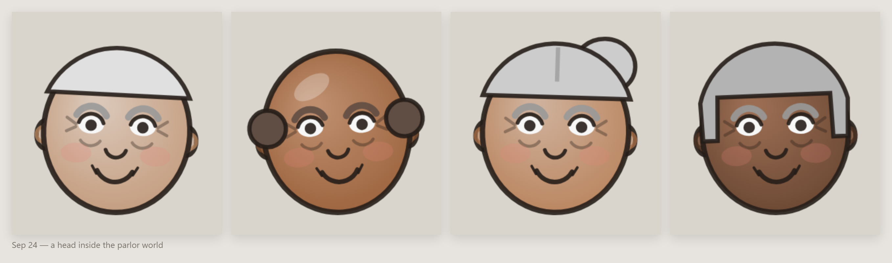
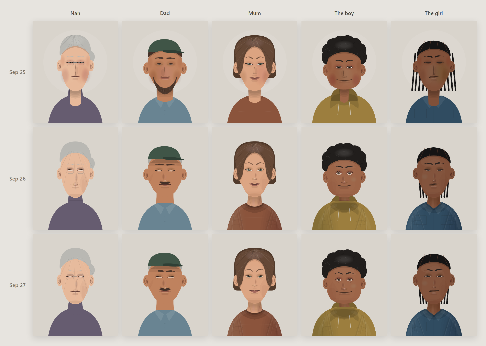
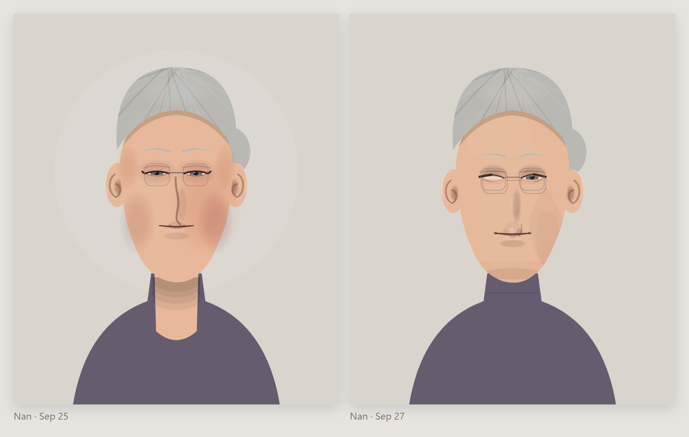
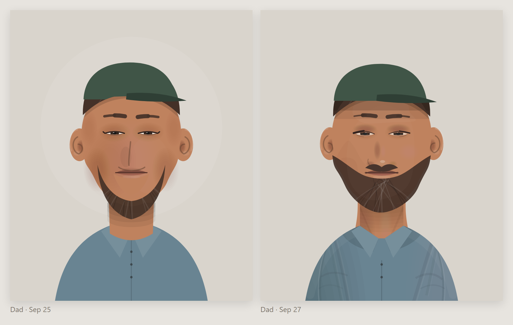
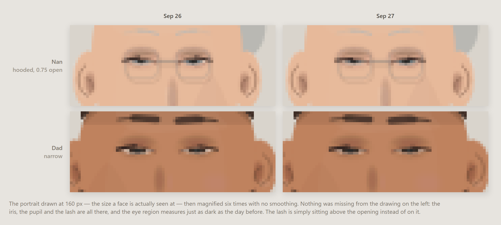

# The family that didn't age

*Three days of changes to a portrait renderer, told through five people who never changed.*

---

## The idea, in one paragraph

Pick five portrait specs — a grandmother, a father, a mother, two kids — and freeze them. They are plain
objects: face width, eye spacing, nose style, a jumper colour. Then hand that same frozen family to each
revision of the drawing code and shoot them again. Nobody in the family gets older, changes clothes or moves.
The only thing that changes between the rows is the hand drawing them. It turns three days of commits into a
family album, and it makes every "why did we change that" answerable by pointing at a face.

No old code goes back into the repo to do it: `git show <rev>:web/visual/portrait.mjs` into a temp file,
import it, render, throw it away. The whole apparatus is `family.mjs` (data) and `render.mjs` (25 lines) in
this folder.

---

## Day 0: three hours, and a head is still a circle with a smile



Faces did not start as a feature. They started as a prop. On 24 September the project got a visual world
called **parlor** — an old folks' home common room, where the drums rock the chairs and the pads fall asleep
under a blanket. That room needed people in it, so it got a `head(ctx, x, y, r, …)` function, and in one
evening that function was rewritten twice.

**18:40.** A filled ellipse, a cap of hair, two dots, an arc for the mouth. At the size it is drawn — a head
about forty pixels across, in a scene that never stops moving — this is a perfectly sensible amount of face.

**19:07.** *"every resident a whole body, legs included, outlined and shaded, with a real face."* The head
gets an ink outline, a radial shade, ears, brows, eyelids with whites and pupils, blush, and the lines of
age at the eye corners. It is much more drawing. It is also much more clearly a cartoon — and look at the
second figure: the bald tufts over the ears are now two dark circles sitting exactly where lenses would be.
Everyone in the room appears to be wearing goggles.

**21:19.** *"glasses on the eyes; ears and bald tufts no longer read as lenses."* The tufts move back and
down, the ears tuck into the skull with their fold inside, and the real glasses go on the eye line where
they belong. Same face, one ambiguity removed.

Three iterations, one evening, and the thing is still an emoji. That was the useful information.

## Day 1: tone over line



The instinct at this point is to blame proportions. It is almost never proportions. What made those heads
cartoons is that **every feature was a stroke**: the eye was an outline, the nose was an arc, the smile was
an arc. Line art is a style, but it is a style that has to be very good not to read as clip art, and nothing
about a procedural generator is going to be very good at line.

So `web/visual/portrait.mjs` (25 September) threw out the line and modelled with tone instead. Every head got
its planes as soft stacked ellipses — eye sockets, cheek hollows, temples, a front light — and a real contour:
a cheekbone, a rounded jaw angle that sits higher on the square and broad heads, a seeded skew so no face is
mirror-symmetric. The nose stopped being a hook and became two shadows and a highlight. The eye filled with
iris under a lid shadow and a lash. Hair got grain — strands that fall, curls on the curly styles, none on
locs and braids — and cast a shadow on the forehead.

Two things went in the bin the same day: a rectangular face shape, and a cigarette prop. A generator gets more
interesting by having fewer bad options, not more options. That is the whole lesson of the next day, arriving
early.

That is the **Sep 25** row above.

## Day 2: the cartoon was never in the face

Then a day of just looking at them. The remaining tells were, almost without exception, *not in the face*.
This is the **Sep 26** row.

**The neck.** The least glamorous fix and the biggest one. A neck used to be a column of its own height,
which meant it stopped somewhere around the collarbone and *sat on top of the jumper* — two tabs of skin on
the shoulders. Now every neck runs to a fixed `NECK_BOTTOM`, behind every garment, and is then drawn a second
time through the hole the outermost neckline makes, closed upward rather than on its own chord. A neckline is
a hole with skin inside it, not a curve painted on cloth. Look at Nan's turtleneck:



**Asymmetry that agrees with itself.** A symmetrical face with one random wobble in it reads as a mistake. A
face where one cheek is fuller *and* one jaw corner sharper *and* one temple wider *and* the chin sits toward
the same side reads as a person. So faces are now built in structural *families*, each carrying three or four
coherent asymmetries on one side, and then perturbed.

**Features derived from each other.** Before, features were parts placed on a head: a broad face got the
default nose. Now eye spacing comes from the face's width, the nose and mouth widths come from the eye spacing,
the mouth sits a fixed gap under the nose tip, and the eyes and brows scale a little with the head (0.92 to
1.12) so one fixed eye is never a bead on a broad face and a saucer on a narrow one.

**Beards cut to the jaw.** A beard used to be a beard-shaped thing fitted over a chin. Now it is a band cut
from *this* face's own outline, let out — so a beard on a square jaw is square. And the moustache rides the
lip it sits on: pinned under the nose, its lower edge taking the lip curve's own move, so a smile bows it and
it is never the one still thing on a moving face.



**Cloth behaving as cloth.** The head's shadow on the chest, shoulder folds, armpit pull, neckline thickness,
the torso shaded as a cylinder. Compare the three shirts above; the collar on the right sits *on* someone.

**Hats that admit hair is under them.** The hair is clipped to below the crown line and pressed in at a slant
rather than cut flat, and because a crown's bottom edge arcs upward, the hat wears a small skirt in its own
colour to fill the crescent of forehead a level cut would leave.

## Day 3: the thing the close-ups hid

The Sep 26 portraits were the best yet at full size — and then somebody looked at the thumbnails and asked why
Nan and Dad had no eyes.



They did have eyes. Sampling the pixels proved it: the iris, the pupil and the lid were all drawn, and the eye
region was, on average, exactly as dark as it had been the day before. What had gone was the *edge*. The old
line-art eye was framed by one heavy stroke corner to corner, so at fifteen pixels it read as a dark dash. The
new eye was built from tone, and its lash line was anchored to the lid curve's Bézier **control** point rather
than the curve itself — about a fifth of the lid's height above the aperture it was supposed to sit on. At a
wide-open eye that gap hides inside the eyelid. At a half-shut one — Nan at 0.75 openness, Dad on a narrow
eye — the lash floats clear of the white, the aperture is three pixels of near-white sclera with a small iris
in the middle of it, and the eye vanishes.

Two lines, both saying the same thing: put the dark back where the eye is. The lash moved down onto the
aperture's drawn edge, and the sclera stopped being nearly white (it now takes 40% of the skin's own tone
rather than 18%). Nothing about the design changed — that is the **Sep 27** row, and it is the only row where
you have to look at the eyes to see the difference at all.

The lesson is not about eyes. It is that a renderer judged only at the size you draw it while you work will
quietly stop working at the size people actually see it.

## The arc

Six revisions over three days, and essentially one move repeated: **stop drawing the outline of a thing and
start drawing the thing the light does to it.** Tone instead of line on the face. A neck that goes *into* a
collar instead of a column parked in front of it. A beard cut from a jaw instead of fitted over one.
Asymmetries that agree with each other instead of dice rolled per feature.

Every change that made the faces more interesting was either subtractive or structural. Nothing in the list
above is a new feature. The props, the halo behind the head (visible in the Sep 25 row, gone by Sep 26) and a
four-setup lighting rig were the additions, and every one of them came back out.

The family in the sheet never aged. Only the hand drawing them did.

---

## Reproducing the pictures

```sh
node blog-ideas/portraits/render.mjs d11afc8 b458cef .    # ./out/sheet.html, one row per revision
```

`family.mjs` is the five specs, written only with keys that exist in every revision's `DEFAULTS`, so the same
five people survive the trip. `render.mjs` pulls each old `portrait.mjs` out with `git show` into a temp file
and imports it — the module has no imports of its own, so nothing else has to be reconstructed, and no old
code is ever checked back in. Day 0 is the one exception: those heads come from `parlor.mjs` at `099ab41`,
`b4499d3` and `89e8053`, which draw to a canvas rather than SVG, so they were shot in a headless browser.
