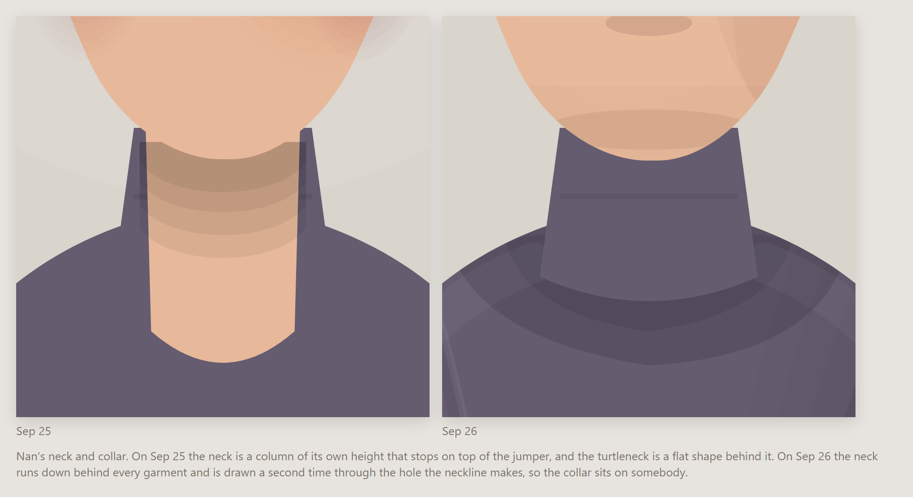
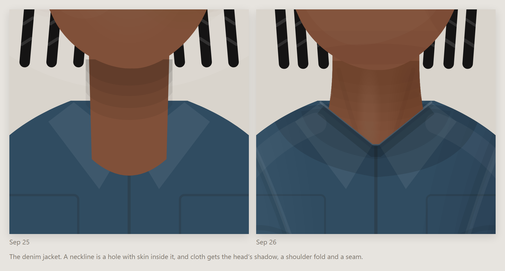
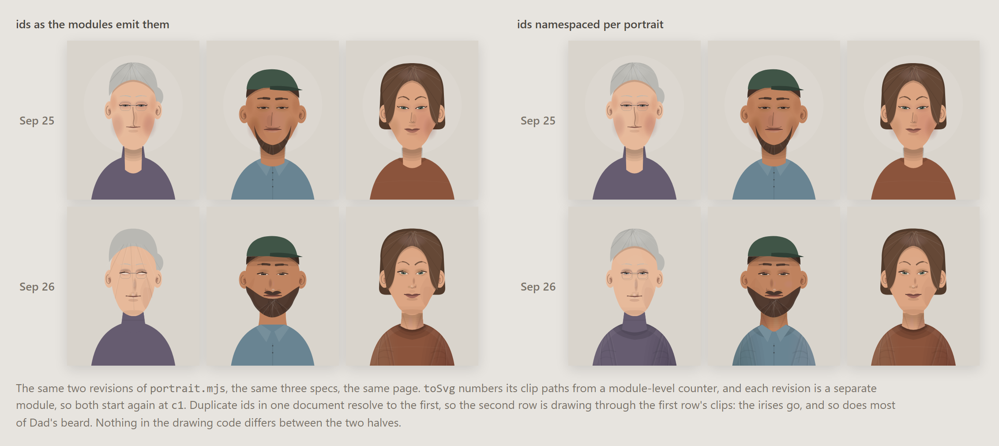
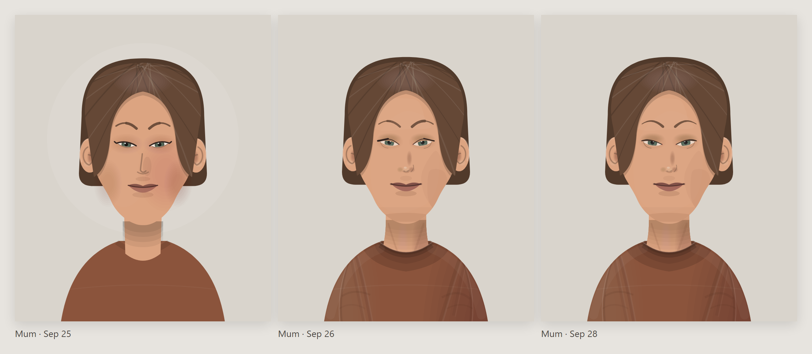
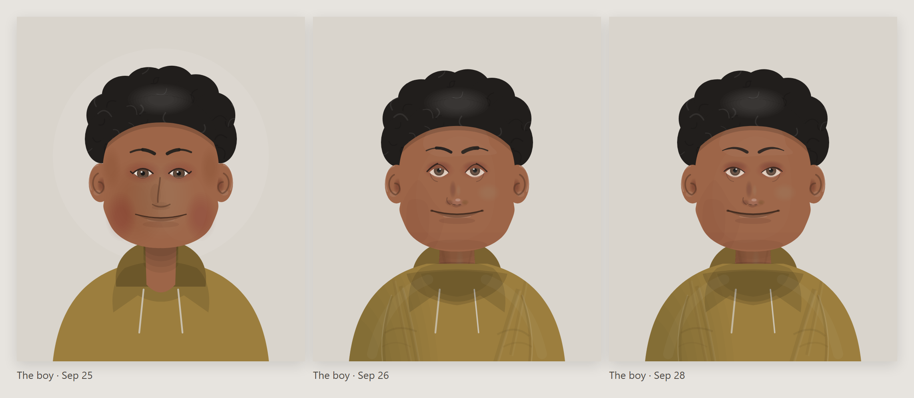
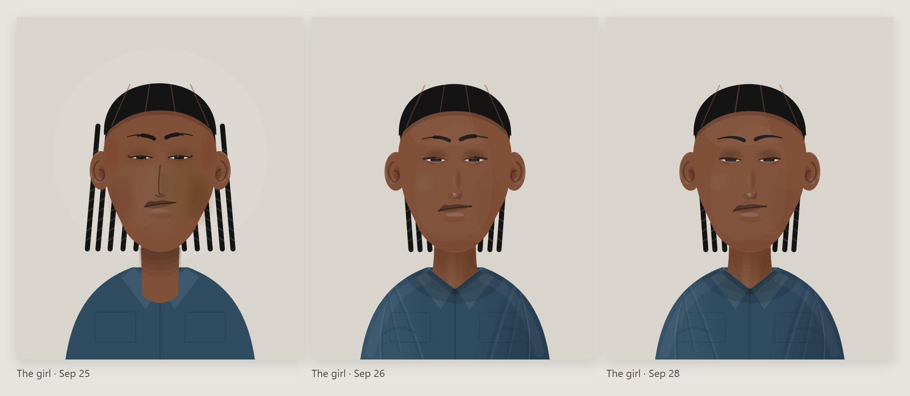

# The family that didn't age

*Four days of changes to a portrait renderer, told through five people who never changed — one day spent
fixing something that was never broken, and one spent building the thing that finds what is.*

---

## The idea, in one paragraph

Pick five portrait specs — a grandmother, a father, a mother, two kids — and freeze them. They are plain
objects: face width, eye spacing, nose style, a jumper colour. Then hand that same frozen family to each
revision of the drawing code and shoot them again. Nobody in the family gets older, changes clothes or moves.
The only thing that changes between the rows is the hand drawing them. It turns four days of commits into a
family album, and it makes every "why did we change that" answerable by pointing at a face.

No old code goes back into the repo to do it: `git show <rev>:web/visual/portrait.mjs` into a temp file,
import it, render, throw it away. The whole apparatus is `family.mjs` (data) and `render.mjs` (forty lines) in
this folder.

---

## Day 0: three hours, and a head is still a circle with a smile


Faces did not start as a feature. They started as a prop. On 24 September the project got a visual world
called **parlor** — an old folks' home common room, where the drums rock the chairs and the pads fall asleep
under a blanket. That room needed people in it, so it got a `head(ctx, x, y, r, …)` function, and in one
evening that function was rewritten twice.

**18:40.** A filled ellipse, a cap of hair, two dots, an arc for the mouth. At the size it is drawn — a head
about forty pixels across, in a scene that never stops moving — this is a perfectly sensible amount of face.

**19:07.** *"every resident a whole body, legs included, outlined and shaded, with a real face."* The head
gets an ink outline, a radial shade, ears, brows, eyelids with whites and pupils, blush, and the lines of
age at the eye corners. It is much more drawing. It is also much more clearly a cartoon — and look at the
second figure: the bald tufts over the ears are now two dark circles sitting exactly where lenses would be.
Everyone in the room appears to be wearing goggles.

**21:19.** *"glasses on the eyes; ears and bald tufts no longer read as lenses."* The tufts move back and
down, the ears tuck into the skull with their fold inside, and the real glasses go on the eye line where
they belong. Same face, one ambiguity removed.

Three iterations, one evening, and the thing is still an emoji. That was the useful information.

## Day 1: tone over line


The instinct at this point is to blame proportions. It is almost never proportions. What made those heads
cartoons is that **every feature was a stroke**: the eye was an outline, the nose was an arc, the smile was
an arc. Line art is a style, but it is a style that has to be very good not to read as clip art, and nothing
about a procedural generator is going to be very good at line.

So `web/visual/portrait.mjs` (25 September) threw out the line and modelled with tone instead. Every head got
its planes as soft stacked ellipses — eye sockets, cheek hollows, temples, a front light — and a real contour:
a cheekbone, a rounded jaw angle that sits higher on the square and broad heads, a seeded skew so no face is
mirror-symmetric. The nose stopped being a hook and became two shadows and a highlight. The eye filled with
iris under a lid shadow and a lash. Hair got grain — strands that fall, curls on the curly styles, none on
locs and braids — and cast a shadow on the forehead.

Two things went in the bin the same day: a rectangular face shape, and a cigarette prop. A generator gets more
interesting by having fewer bad options, not more options. That is the whole lesson of the next day, arriving
early.

That is the **Sep 25** row above.

## Day 2: the cartoon was never in the face

Then a day of just looking at them. The remaining tells were, almost without exception, *not in the face*.
This is the **Sep 26** row.

**The neck.** The least glamorous fix and the biggest one. A neck used to be a column of its own height,
which meant it stopped somewhere around the collarbone and *sat on top of the jumper* — two tabs of skin on
the shoulders. Now every neck runs to a fixed `NECK_BOTTOM`, behind every garment, and is then drawn a second
time through the hole the outermost neckline makes, closed upward rather than on its own chord. A neckline is
a hole with skin inside it, not a curve painted on cloth. Look at Nan's turtleneck, and at the girl's denim
jacket, where the neckline is a V cut into the cloth with a neck coming up through it:






**Asymmetry that agrees with itself.** A symmetrical face with one random wobble in it reads as a mistake. A
face where one cheek is fuller *and* one jaw corner sharper *and* one temple wider *and* the chin sits toward
the same side reads as a person. So faces are now built in structural *families*, each carrying three or four
coherent asymmetries on one side, and then perturbed.

**Features derived from each other.** Before, features were parts placed on a head: a broad face got the
default nose. Now eye spacing comes from the face's width, the nose and mouth widths come from the eye spacing,
the mouth sits a fixed gap under the nose tip, and the eyes and brows scale a little with the head (0.92 to
1.12) so one fixed eye is never a bead on a broad face and a saucer on a narrow one.

**Beards cut to the jaw.** A beard used to be a beard-shaped thing fitted over a chin. Now it is a band cut
from *this* face's own outline, let out — so a beard on a square jaw is square. And the moustache rides the
lip it sits on: pinned under the nose, its lower edge taking the lip curve's own move, so a smile bows it and
it is never the one still thing on a moving face.


**Cloth behaving as cloth.** The head's shadow on the chest, shoulder folds, armpit pull, neckline thickness,
the torso shaded as a cylinder. Compare the two shirts above; the collar on the right sits *on* someone.

**Hats that admit hair is under them.** The hair is clipped to below the crown line and pressed in at a slant
rather than cut flat, and because a crown's bottom edge arcs upward, the hat wears a small skirt in its own
colour to fill the crescent of forehead a level cut would leave.

## Day 3: a whole day spent on a bug that was not there

The Sep 26 portraits were the best yet at full size — and then somebody looked at this very sheet and asked why
Nan and Dad had no eyes.

They were right: in the sheet, they did not. Blank white almonds, no iris, no pupil. Dad's beard was mostly gone
too, though nobody noticed that until later.

What followed was most of a day of increasingly careful work on the eye code. The lash was moved off the lid
curve's Bézier control point and onto the aperture it is supposed to sit on. The sclera stopped being nearly
white. The lower lid was given a floor so `openness` could not drag the aperture under two pixels. The `narrow`,
`hooded` and `monolid` apertures went up a third. The iris became a share of the eye's width so that opening a
lid would show more eye and not more white. Each of these was defensible. Two of them were probably improvements.
All of them were fixing nothing.

The clue was in plain sight the whole time and took three rounds to read: the eyes were missing on **one side
only**, and the sole difference between Nan's two eyes is `asym: 0.92`. The other clue was that every
measurement taken on a single portrait — sampling the actual pixels, scanning the eye region, comparing the
average darkness against the day before — came back saying the eye was exactly as dark as it had always been.
It was. The eye was fine. The **sheet** was broken.



`toSvg` gives each clip path an id from a counter, with a comment explaining that ids are document-wide so the
counter is module-level. That is correct, and it works, for the page, which loads exactly one `portrait.mjs`.
But the comparison sheet loads *several revisions of that module at once*, and each one starts its counter again
at `c1`. Two `c1`s in one document resolve to the first, so every portrait after the first row was drawing
through some earlier portrait's clips — clips cut for a different face at a different height. The irises fell
outside them and vanished. So did the beard. So did the odd hard creases that had been appearing on Nan's cheek,
which I had been reading as over-aggressive plane shading.

The renderer never changed. Both fixes are reverted; `portrait.mjs` is byte-identical to where it stood on
Sep 26, and the eye styles are the ones that were authored. The sheets namespace their ids, which is four lines
in a scratchpad script that is not part of the project.

The lesson I actually wanted from this post was that a renderer judged only at the size you work at will stop
working at the size people see it. That turned out to be a nicer lesson than the true one, which is: when your
instrument and your subject disagree three times running, stop adjusting the subject.

## Day 4: the editor, and every fault it found was the same fault

The **Sep 28** row is the third one in the sheet, and it exists because of a tool rather than a session of
staring. `portrait.html` is an editor for exactly one face: a control per parameter, grouped in the order the
face is built — base, head, features, hair, clothing, pose and light — over a state of three things,
`{ seed, family, ov }`. `seed` and `family` draw a random person out of one structural family; `ov` is the
edits as flat dotted paths over that person, so one control writes one parameter and nothing else. The whole
state encodes into the URL hash, which means **the hash is the face**: the same link is the same portrait, and
every committed edit is a history entry, so the browser's Back button walks backwards through them.

Being able to drag one number and watch the rest of the face fail to follow it turns out to find a particular
kind of bug, and it only found the one kind. Every fault in the list below is **a part drawn at a fixed size
sitting next to a part that scales.**

**The ear.** Shrink an ear and the shell shrank; the rim of the helix and the lobe's highlight did not, so a
small ear came out as a small shell with a full-size rim lying beside it. The ear is now drawn once at size
1 — shell, the bowl in shadow, the lobe, the rim — and the whole thing scaled about its own centre. Compare
anyone's ears across the last two rows; the boy's are the clearest.

**Brows and upper lids.** These were two constant-width strokes butted end to end, which shows the joint as a
step and leaves the thin one sticking out past the fat one like a whisker. A brow is not two strokes, it is
one stroke that changes weight along its length, so there is now a `taper(a, c, b, wf)` that walks a quadratic
and returns the whole thing as one filled outline, `wf(t)` being the width at t.

**Hats.** A hat was sized and seated on the skull, but it is never worn on a skull: every hair style rises
about forty units above one. So a hat on a bob sat inside the hair with the flat cut showing past it as a
shelf at the temple, and a hat on a receding or buzzed head hung in the air over hair that was not there. A hat
now takes the width of the hair it actually goes over (up to 1.22× its bare size, past which it is a costume
and a big afro is meant to show around it) and drops by whatever lift the hair failed to supply, crown line,
skirt and brim shadow together. Dad's cap in the Sep 28 panel is sitting on his head for the first time.

**The turtleneck.** A fixed tube, on every neck. It is now cut to this neck's own width with a little slack,
and its top sits just under the chin wherever the neck happened to put it — see Nan.

**Teeth**, for the mouths open enough to have any: the band between the two lips, shaped to both of them, and
the band is also the clip, so a gap or a crooked edge is drawn as a straight mark running past the band's edge
and cut there rather than fitted to it by hand.

And a scatter of styles that had been drawn as one thing pretending to be several: cornrows parted to the skin
between the rows instead of hatched on a cap of hair, a mohawk with the sides actually shaved so a hat sits on
the skull, a beret as a soft disc with no crown seam, and nose and lip hoops drawn as *half* a ring, because
the other half is inside the face.

Day 2's lesson was that the cartoon was not in the face. Day 4's is that it was not in any one part either: it
is in the parts that never got the memo when a neighbouring part learned to scale. You do not find those by
looking at finished portraits, because each one looks deliberate. You find them by dragging a single number
and noticing what stays still.

## The arc

Six revisions of the drawing over four days, and essentially one move repeated: **stop drawing the outline of a thing and
start drawing the thing the light does to it.** Tone instead of line on the face. A neck that goes *into* a
collar instead of a column parked in front of it. A beard cut from a jaw instead of fitted over one. A hat that
takes its size from the hair rather than the skull. Asymmetries that agree with each other instead of dice
rolled per feature.

Almost every change that made the faces more interesting was subtractive or structural — a part measured off
its neighbour instead of off a default. The handful of genuinely new things (teeth, a waistcoat, a nose hoop)
changed nothing about whether a face reads as a person. Meanwhile the props, the halo behind the head (visible
in the Sep 25 row, gone by Sep 26) and a four-setup lighting rig were the other additions, and every one of
them came back out.

The family in the sheet never aged. Only the hand drawing them did.

## The rest of the family

The other three carry the same three revisions, and between them they cover what Nan and Dad do not: the boy's
hoodie, the hair under the girl's braids, and a face with neither a beard nor glasses to hide behind.







---

## Reproducing the pictures

```sh
node blog-ideas/portraits/render.mjs 'd11afc8=Sep 25' 'b458cef=Sep 26' '.=Sep 28'
# ./out/sheet.html, one row per revision, plus out/<who>.html, one person across all of them
```

An argument is a revision, or `<rev>=<row label>`, because the rows are labelled by the evening the drawing
was written and a commit that lands at 00:32 belongs to the day before it. `.` is the working tree.
`family.mjs` is the five specs, written only with keys that exist in every revision's `DEFAULTS`, so the same
five people survive the trip. `render.mjs` namespaces each portrait's clip ids, which is the entire subject of
day three. `render.mjs` pulls each old `portrait.mjs` out with `git show` into a temp file
and imports it — the module has no imports of its own, so nothing else has to be reconstructed, and no old
code is ever checked back in. Day 0 is the one exception: those heads come from `parlor.mjs` at `099ab41`,
`b4499d3` and `89e8053`, which draw to a canvas rather than SVG, so they were shot in a headless browser.
